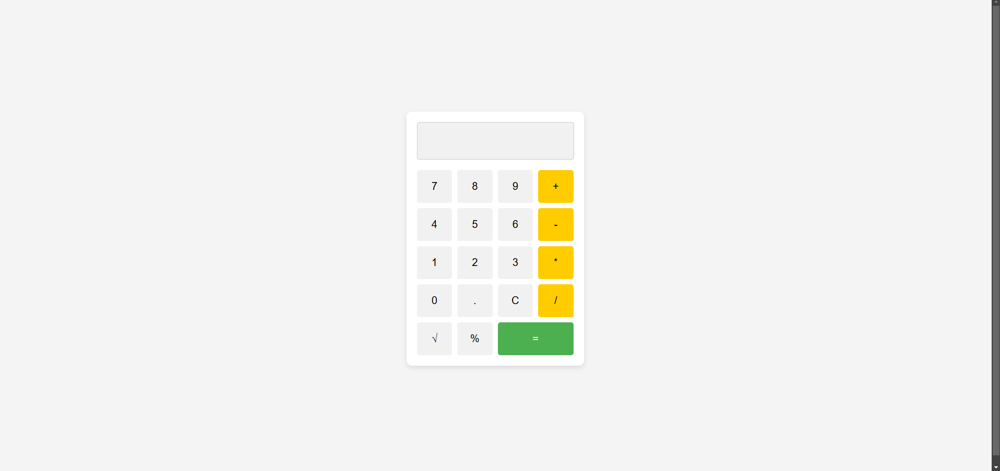

# Simple Calculator

This project is a **responsive calculator application** implemented with a clean and accessible user interface. It is designed to perform basic arithmetic operations and is an excellent beginner-friendly project for working with HTML, CSS, and JavaScript. The calculator is styled with a modern, minimalistic design and can be easily extended with additional features.

## Features

1. **Basic Arithmetic Operations:**
   - Addition (`+`)
   - Subtraction (`-`)
   - Multiplication (`*`)
   - Division (`/`)

2. **Additional Functionalities:**
   - Square Root (`√`)
   - Percentage (`%`)
   - Clear (`C`) button to reset all inputs.

3. **Decimal Support:**
   - Includes support for floating-point numbers using the `.` button.

4. **Responsive Design:**
   - Works seamlessly on devices with different screen sizes, including desktops, tablets, and mobile devices.

5. **Real-Time Display:**
   - An input display area at the top that dynamically updates with the current inputs and results.

6. **Stylish UI:**
   - Number buttons (`0-9`) styled for easy interaction.
   - Clear and functional layout with distinct colors for operators, numbers, and the equal button.

## Tech Stack

- **HTML**: For structuring the calculator layout.
- **CSS**: For styling the calculator to have a modern and minimalistic appearance.
- **JavaScript**: For implementing the core calculator logic and interactivity.

## Functional Design

1. **User Interface:**
   - A digital display at the top for showing the input values and results.
   - A grid-based design for buttons, ensuring intuitive placement of numbers and operators.
   - Buttons are color-coded:
     - Numbers: Neutral color (e.g., gray/white).
     - Operators: Distinct color (e.g., yellow).
     - Equal button: Differentiated (e.g., green).

2. **Button Interaction:**
   - Each button press updates the display in real-time.
   - The `=` button calculates and displays the result.
   - The `C` button clears the display for fresh calculations.
   - The calculator handles invalid operations (e.g., dividing by zero) gracefully.

3. **Responsiveness:**
   - The layout adapts to screen sizes using CSS media queries or flexbox/grid layouts.
